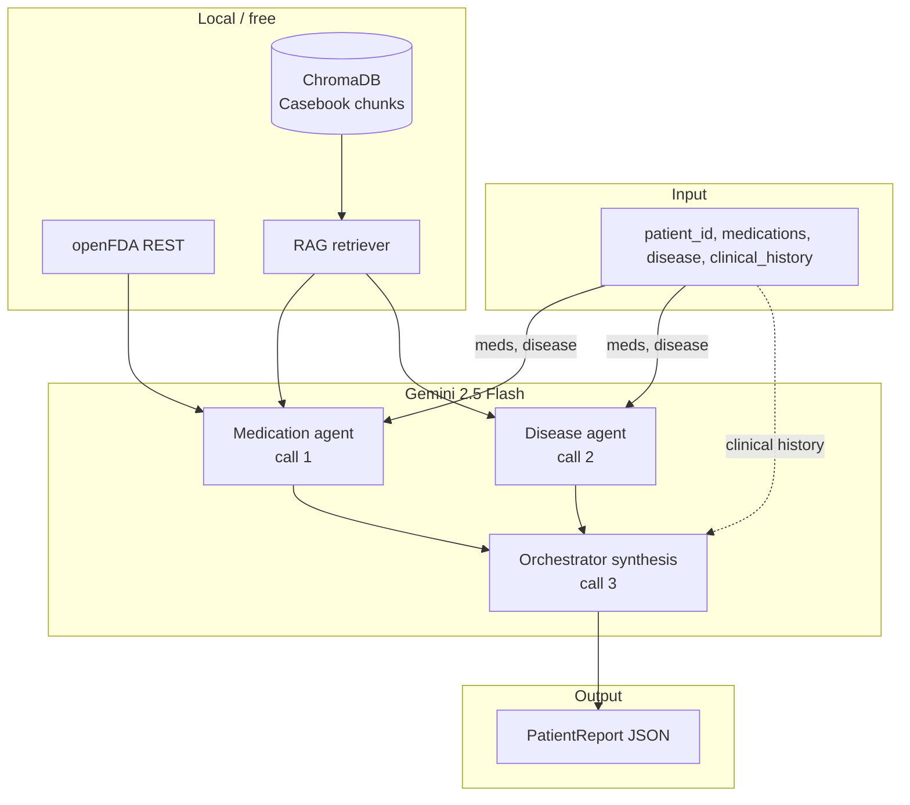

# DrugChecker — DRP Multiagent System

A **Drug-Related Problem (DRP)** decision-support pipeline that classifies medication issues using the **PCNE v9.1** framework. The system combines three **Gemini 2.5 Flash** calls per patient, a local **RAG** stack over the *Pharmacotherapy Casebook*, and live **openFDA** drug labels—all on a free-tier stack suitable for academic and prototyping use.

> **Clinical disclaimer:** All outputs are for decision-support only and must be reviewed by a licensed pharmacist or physician before any clinical use.

---

## Table of contents

1. [What was built](#what-was-built)
2. [Architecture](#architecture)
3. [How to use](#how-to-use)
4. [Configuration](#configuration)
5. [Evaluation benchmark](#evaluation-benchmark)
6. [Verified behavior](#verified-behavior)
7. [How it can be improved](#how-it-can-be-improved)
8. [Project layout](#project-layout)

---

## What was built

### Problem and goal

Hospital pharmacotherapy cases often involve multiple drugs, comorbidities, and guideline conflicts. This project automates a structured **DRP workup**: identify whether a drug-related problem exists, classify it under PCNE (problem type **P1–P7**, cause **C1–C8**), rate severity, and suggest an intervention—with traceable evidence from a knowledge base and FDA labels.

### Design constraints (from the spec)

| Constraint | How it is handled |
|--------------|-------------------|
| No paid APIs | Gemini free tier, local ChromaDB, openFDA (no key) |
| Gemini limits (10 RPM, 250 RPD) | Exactly **3 calls/patient**; eval uses `--concurrency 1` |
| Decomposition without LLM | Patient input parsing, Pydantic assembly, enum mapping in Python |
| Structured output | `response_mime_type=application/json` + Pydantic `PatientReport` |

### Major components

1. **Data contracts (`drp_system/models/drp_schema.py`)**  
   Pydantic models: `MedicationFinding`, `DRPClassification`, `PatientReport`, with enums for PCNE categories, causes, and severity.

2. **LLM layer (`drp_system/llm/gemini_client.py`)**  
   Async Gemini client with exponential backoff on 429/503, JSON fence stripping, drug-name normalization for FDA lookup, and RAG context truncation to avoid token blowups.

3. **RAG pipeline (`drp_system/rag/`)**  
   - **Ingest:** PyMuPDF → text chunks (600 chars, 80 overlap) → `sentence-transformers/all-MiniLM-L6-v2` → ChromaDB (`data/chroma_db/`).  
   - **Primary KB:** *Pharmacotherapy Casebook* PDF (`pharmacotherapy-casebook_929.pdf`, ~3,317 chunks after ingest).  
   - **Retriever:** Top-`k` semantic search per agent query.  
   - **openFDA:** Async label fetch (warnings, contraindications, interactions) per medication.

4. **Multiagent pipeline (`drp_system/agents/`)**  
   - **Medication agent:** RAG + openFDA → JSON findings per drug.  
   - **Disease agent:** RAG → JSON disease–drug profile and conflicts.  
   - **Orchestrator:** Runs both agents in parallel, then one synthesis call → final PCNE classification.

5. **CLI (`drp_system/main.py`)**  
   Single-patient run with `--patient-id`, `--medications`, `--disease`, `--clinical-history`, `--output`.

6. **Evaluation harness (`drp_system/eval/`)**  
   Loads `cases_analysis_v2_clean_en.csv` (49 annotated cases), runs the pipeline, scores **DRP detection** and **PRM→PCNE category alignment**, writes `eval/results/run_<timestamp>.json`.

### Knowledge base

The vector store is built from the **Pharmacotherapy Casebook** (symlinked into `data/knowledge_base/` on ingest). The PDF is **gitignored** (copyright). Re-run ingest after adding more PDFs or CSVs to `data/knowledge_base/`.

Do **not** use `ingest_cases` for production evaluation—it embeds ground-truth justifications from the benchmark CSV and can inflate scores.

---

## Architecture



**Per-patient API budget**

| Step | Calls | Parallel? |
|------|-------|-----------|
| Medication agent | 1 | Yes (with disease agent) |
| Disease agent | 1 | Yes |
| Orchestrator synthesis | 1 | After agents complete |
| **Total** | **3** | 2 + 1 |

---

## How to use

### Prerequisites

- [pyenv](https://github.com/pyenv/pyenv) with **Python 3.12.11** (see `.python-version`)
- `pharmacotherapy-casebook_929.pdf` in the project root (not in git)
- A free [Gemini API key](https://aistudio.google.com/app/apikey)

### 1. Install

```bash
cd /path/to/iamedicos
pyenv install -s 3.12.11
python -m pip install -r requirements.txt
cp .env.example .env
# Edit .env: GEMINI_API_KEY=your_key_here
```

Optional isolated environment:

```bash
python -m venv .venv && source .venv/bin/activate
pip install -r requirements.txt
```

If `pyenv init` fails in restricted shells, call Python directly:

```bash
~/.pyenv/versions/3.12.11/bin/python -m drp_system.main --help
```

### 2. Build the vector store (once per KB change)

```bash
python -m drp_system.rag.ingest
```

Expect several minutes on first run (PDF parse + embedding). Output example: `Vector store built: 3317 chunks.`

**Smoke-test retrieval:**

```bash
python -c "
from drp_system.rag.retriever import retrieve
for i, c in enumerate(retrieve('NSAID contraindication chronic kidney disease')):
    print(f'--- chunk {i+1} ---\n', c[:300])
"
```

### 3. Analyze one patient

**Default example** (T2DM + CKD stage 3; ibuprofen + ACE inhibitor):

```bash
python -m drp_system.main --patient-id PT-001
```

**Custom case:**

```bash
python -m drp_system.main \
  --patient-id CASE-007 \
  --medications "Triamterene/HCTZ" "Insulin 70/30" "Entex PSE" \
  --disease "Hypertension" \
  --clinical-history "Patient complains of persistent dry cough." \
  --output output_report.json
```

The CLI prints a JSON `PatientReport` and a short summary (DRP present, PCNE category, intervention, confidence). Full structure is written to `output_report.json` (gitignored).

### 4. Benchmark on the case suite

`cases_analysis_v2_clean_en.csv` columns:

| Column | Meaning |
|--------|---------|
| `ID` | Case identifier |
| `LM` | Medication list |
| `HS` | Health situation / disease |
| `PRM` | Problem type: Safety, Adherence, Efficacy, Indication |
| `Jus` | Expert justification |
| `TE` | Clinical evidence excerpt (mapped to `clinical_history`) |

**Run evaluation:**

```bash
# Quick smoke (2 cases, ~2–3 min)
python -m drp_system.eval.run_eval --case-id 7 --case-id 9 --concurrency 1

# First N cases
python -m drp_system.eval.run_eval --limit 10 --concurrency 1

# Paginated batches (CSV order; offset skips completed rows)
python -m drp_system.eval.run_eval --offset 13 --limit 10 --concurrency 1

# Full suite (~49 × 3 calls ≈ 147 API calls; stay within 250 RPD)
python -m drp_system.eval.run_eval --concurrency 1
```

Results land in `eval/results/run_<timestamp>.json` with per-case reports and aggregate metrics:

- **drp_detection_rate** — fraction with `drp_present: true`
- **prm_category_match_rate** — predicted PCNE **P**-prefix matches expected PRM bucket (see below)

### Rate limits (Gemini free tier)

| Limit | Value | Practical impact |
|-------|-------|------------------|
| RPM | 10 | Keep `--concurrency 1`; two parallel agent calls = 2 RPM |
| RPD | 250 | ~83 patients/day at 3 calls each |
| TPM | 250,000 | RAG context capped at 4000 chars per agent |

---

## Configuration

Edit `drp_system/config.py` or environment variables:

| Setting | Default | Purpose |
|---------|---------|---------|
| `GEMINI_MODEL` | `gemini-2.5-flash` | LLM; can switch to `gemini-2.5-flash-lite` for higher quota |
| `EMBED_MODEL` | `all-MiniLM-L6-v2` | Embedding model for ChromaDB |
| `RAG_TOP_K` | `5` | Chunks retrieved per query |
| `RAG_CONTEXT_MAX_CHARS` | `4000` | Max RAG text injected per prompt |
| `CHUNK_SIZE` / `CHUNK_OVERLAP` | `600` / `80` | Ingest chunking |
| `GEMINI_MAX_OUTPUT_TOKENS` | `8192` | Avoid truncated JSON from agents |

Biomedical embeddings (better domain fit, more RAM):

```python
EMBED_MODEL = "pritamdeka/BioBERT-mnli-snli-scinli-scitail-mednli-stsb"
```

After changing embeddings, **re-run** `python -m drp_system.rag.ingest`.

---

## Evaluation benchmark

Ground-truth `PRM` labels map to acceptable PCNE **problem** categories:

| PRM (CSV) | Acceptable PCNE categories |
|-----------|----------------------------|
| Safety | P1, P2, P5, P6 |
| Adherence | P4 |
| Efficacy | P2, P3 |
| Indication | P7 |

The harness does not yet score textual similarity to `Jus`/`TE`; category match is a coarse proxy for classification quality.

---

## Verified behavior

Internal runs (casebook ingested, Gemini configured):

| Test | Result |
|------|--------|
| **PT-001** (ibuprofen + CKD + lisinopril) | DRP detected; **P2** drug choice; major; discontinue NSAID |
| **Cases 7 & 9** (eval) | 2/2 DRP detected; 100% PRM→PCNE match |

Known failure mode (fixed): Gemini JSON truncated at 2048 output tokens—resolved by raising `GEMINI_MAX_OUTPUT_TOKENS` and shortening agent prompts.

---

## How it can be improved

### Near term (quality)

| Area | Improvement |
|------|-------------|
| **RAG quality** | Switch to BioBERT embeddings; add PCNE PDF, WHO formulary, DrugBank open CSV; chunk metadata (source, page) for citations |
| **Retrieval** | Hybrid search (BM25 + vectors); reranker; query expansion per agent |
| **FDA lookup** | Better parsing of combination products (`Aspirin/Dipyridamole`); RxNorm normalization |
| **Evaluation** | BLEU/semantic similarity vs `Jus`; per-PRM confusion matrix; implicated-drug overlap |
| **Validation** | Pydantic validation of agent JSON before synthesis; repair pass on malformed JSON |

### Medium term (product)

| Area | Improvement |
|------|-------------|
| **Multiple DRPs** | Return `list[DRPClassification]` when several problems coexist |
| **CLI / API** | FastAPI endpoint; batch runner with `asyncio.Semaphore` |
| **Observability** | Structured logs, token/cost counters, Langfuse-style traces |
| **Caching** | Cache openFDA + agent outputs per medication set hash |

### Long term (clinical rigor)

| Area | Improvement |
|------|-------------|
| **Human-in-the-loop** | Review UI; pharmacist override with audit trail |
| **Guidelines** | Integrate structured guideline APIs where licensing allows |
| **Safety** | Remove eval CSV from RAG; separate dev/prod collections |
| **Compliance** | HIPAA-ready deployment, no PHI in logs, key rotation |


---

## Project layout

```
iamedicos/
├── drp_system/
│   ├── agents/
│   │   ├── medication_agent.py   # RAG + openFDA → findings
│   │   ├── disease_agent.py      # RAG → disease–drug analysis
│   │   └── orchestrator.py       # Parallel agents + synthesis
│   ├── eval/
│   │   ├── cases_loader.py       # CSV + PRM→PCNE mapping
│   │   └── run_eval.py           # Benchmark runner
│   ├── llm/
│   │   └── gemini_client.py      # Gemini + retry + helpers
│   ├── models/
│   │   └── drp_schema.py         # PCNE Pydantic models
│   ├── rag/
│   │   ├── ingest.py             # PDF/CSV → ChromaDB
│   │   ├── ingest_cases.py       # Dev-only CSV seed (avoid for eval)
│   │   ├── retriever.py          # Semantic search
│   │   └── openfda.py            # Live FDA labels
│   ├── config.py
│   └── main.py                   # CLI entry point
├── data/
│   ├── knowledge_base/           # Symlinked PDFs/CSVs
│   └── chroma_db/                # Vector store (gitignored)
├── cases_analysis_v2_clean_en.csv
├── pharmacotherapy-casebook_929.pdf  # gitignored
├── eval/results/                 # Benchmark outputs (gitignored)
├── requirements.txt
├── .env.example
├── IMPLEMENTATION_PLAN.md
└── implementation.md
```

---

## Security notes

- Never commit `.env` or API keys.
- Rotate any key that was shared in chat or logs.
- The casebook PDF is copyrighted—keep it local and gitignored.
